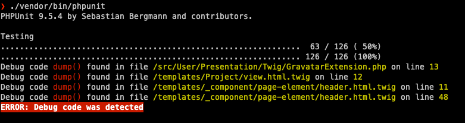

# PHPUnit debug code detector 
Have you ever pushed code to a repository containing debug code? 
Me Too! With this PHPUnit extension you'll at least be notified when your test run.




### Install

Require
```shell
$ composer require --dev laulamanapps/phpunit-debug-code-detector
```

Configure:
```xml
<extensions>
    <extension class="LauLamanApps\PhpunitDebugCodeDetector\PhpunitDebugCodeDetectorExtension">
        <arguments>
            <array><!-- Folders we want scanned -->
                <element key="0"><string>src</string></element>
                <element key="1"><string>templates</string></element>
            </array>
        </arguments>
    </extension>
</extensions>
```


Enable only some detectors:
```xml
<extensions>
    <extension class="LauLamanApps\PhpunitDebugCodeDetector\PhpunitDebugCodeDetectorExtension">
        <arguments>
            <array><!-- Folders we want scanned -->
                <element key="0"><string>src</string></element>
                <element key="1"><string>templates</string></element>
            </array>
            <array><!-- Detectors we want to use -->
                <element key="0"><string>LauLamanApps\PhpunitDebugCodeDetector\Detector\Php\VarDumpDetector</string></element>
                <element key="1"><string>LauLamanApps\PhpunitDebugCodeDetector\Detector\Php\PrintRDetector</string></element>
                <element key="2"><string>LauLamanApps\PhpunitDebugCodeDetector\Detector\Symfony\VarDumper\DumpDetector</string></element>
            </array>
        </arguments>
    </extension>
</extensions>
```

Disable colorful output:
```xml
<extensions>
    <extension class="LauLamanApps\PhpunitDebugCodeDetector\PhpunitDebugCodeDetectorExtension">
        <arguments>
            <array><!-- Folders we want scanned -->
                <element key="0"><string>src</string></element>
                <element key="1"><string>templates</string></element>
            </array>
            <string>all</string><!-- Use all detectors -->
            <bool>false</bool>
        </arguments>
    </extension>
</extensions>
```
